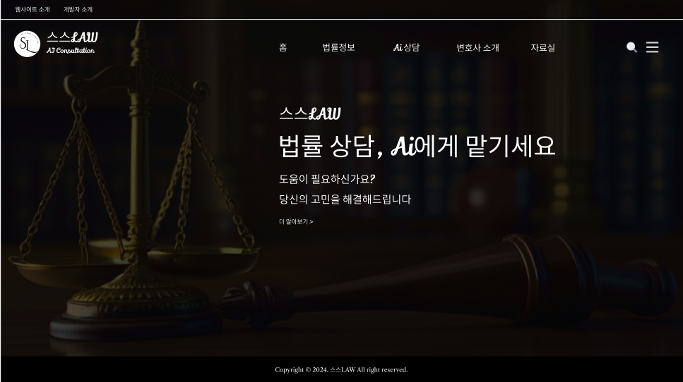
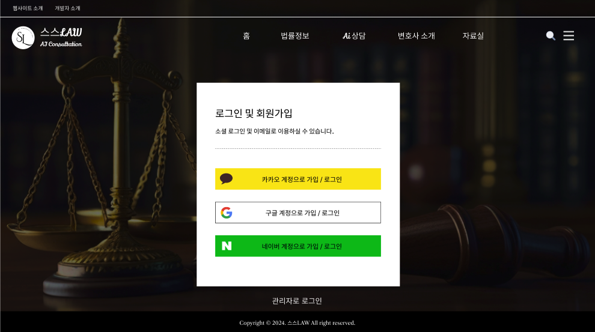
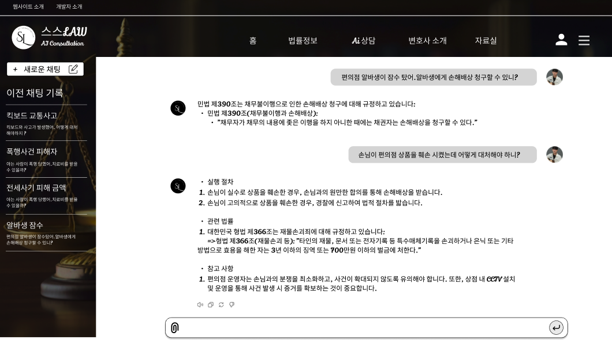
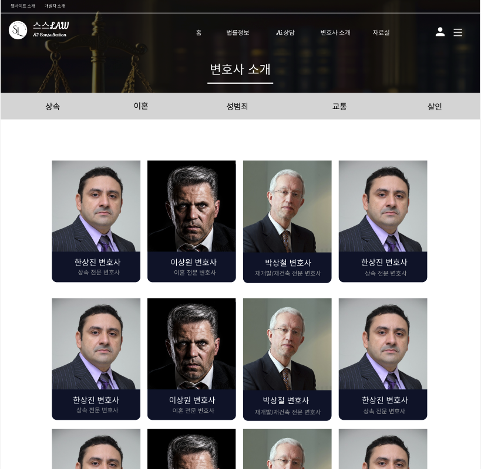
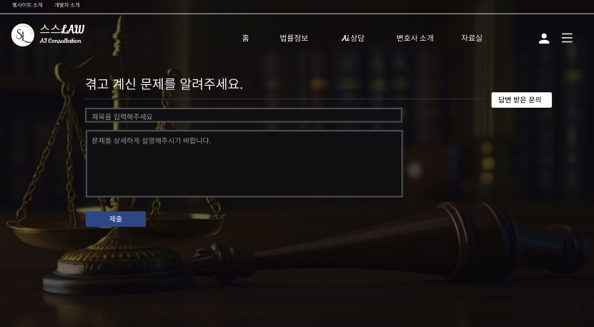

  

## 1. 📌 프로젝트 개요

> AI 챗봇 기반의 법률 상담 플랫폼  
> 사용자들이 일상 속 법적 고민을 누구에게도 드러내지 않고  
> **편안하게 상담받을 수 있는 온라인 채팅 공간**을 제공하는 서비스

---

## 2. 👨‍💻 개발 팀원

| 이름   | 역할                             |
| ------ | -------------------------------- |
| 강재훈 | Frontend 개발                    |
| 박정우 | Frontend 개발                    |
| 박상민 | Backend 개발                     |
| 윤영진 | Backend 개발                     |
| 배성율 | 법률chatAI와 소송장 작성 AI 개발 |

---

## 3. 💡 개발 배경

일반인에게는 변호사와의 직접 상담이 **경제적·심리적 장벽**이 높은 경우가 많고,  
민감한 사안의 경우 주변 사람들에게 쉽게 이야기하기 어렵다는 문제가 있음.

이러한 문제를 해결하기 위해  
**익명성과 접근성을 갖춘 AI 기반 법률 상담 서비스**를 기획하고 개발하게 됨.

---

## 4. 📷 프로토타입

### Home

  

### Login

  

### Chat

  

### Lawyer Board

  

### Inquiry

  

---

## 5. ⚙️ 기술 스택

- **Frontend**: JavaScript, React, AWS (EC2, CloudFront)
- **Backend**: Spring Boot, MySQL
- **AI 엔진**: Python 기반 텍스트 생성 모델  
  *(도입을 시도했으나 라이브러리 및 환경 문제로 완전한 구현에는 실패)*

---

## 6. 🚀 주요 기능

### 🤖 AI 법률 상담 챗봇

- **ChatGPT 스타일 채팅 인터페이스 제공**
- 상담 내용 **자동 저장 및 이전 대화 내역 조회 기능**
- 향후 **AI 법률 모델 연동을 고려한 구조 설계**

---

### 📝 문서 자동 생성 기능

- 사용자가 피해 상황을 입력하면 **고소장 / 소송장 형식의 문서 자동 생성**
- 개인정보 항목은 직접 입력하도록 구성
- 민감 정보는 **AI가 자동 마스킹 처리**
- 생성된 문서는 **온라인 저장소에 자동 저장되며 열람 및 삭제 가능**

---

### 👤 변호사 전용 프로필

- 협력 변호사 소개 페이지 제공
- 관리자 페이지에서 **프로필 등록 및 삭제 관리**

---

### 🔧 기타 기능

- **카카오 / 네이버 / 구글 소셜 로그인**
- **법률 정보 웹 크롤링 기능 구현 시도**

---

## 7. ✅ 구현 결과

> AI 상담 기능은 라이브러리와 환경적 한계로 완전한 구현에는 이르지 못했지만  
> 주요 서비스 기능은 정상적으로 구현

- 소셜 로그인 및 랜딩 페이지 구현
- ChatGPT 스타일 UI 기반 **채팅 인터페이스 구현**
- **채팅 기록 저장 및 조회 기능**
- 협력 변호사 프로필 페이지 구현
- 생성된 법률 문서의 **저장 및 삭제 기능**

---

## 8. 🏆 수상 경력

> 기술적 한계에도 불구하고 서비스 기획력과 플랫폼 완성도를 인정받아

교내 **AI/SW Developers 대회에서 우수상 수상**

---

## 9. 🔧 개선 방향

### 💬 인터페이스 개선

- 메시지 UI에 **전환 효과 및 애니메이션 추가**
- ChatGPT 스타일을 유지하면서 **UX 개선 및 디자인 완성도 향상**

### 🛠 기능 보완

- 법률 검색 기능 **크롤링 안정성 개선**
- 변호사 프로필 기능을 **사용자 페이지와 관리자 페이지로 역할 분리**

### 🎨 디자인 개선

- **폰트 통일**
- 레이아웃 정리 및 UI 일관성 개선

---

## 10. 🐛 발생했던 문제와 해결 경험

- 로그인 이후 **리다이렉트가 정상적으로 이루어지지 않는 문제 발생**
- OAuth 인증 흐름과 프론트엔드 상태 관리 로직을 수정하여 해결

### 개선이 필요했던 부분

- 일반 사용자 로그인 화면에 **관리자 로그인 버튼이 노출된 구조**
- 채팅 컴포넌트 하나에 **WebSocket 연결, 메시지 관리, 채팅방 관리 등 너무 많은 책임이 집중된 구조**

---

## 11. 🧠 프로젝트를 진행하며 배운 점

- AI 기술을 실제 서비스에 적용하는 것이 생각보다 쉽지 않다는 것을 경험함
- 기술 구현에 한계가 있을 때 **대안을 고민하고 구조를 조정하는 능력**이 중요함을 배움
- 프로젝트의 완성도뿐 아니라 **기획 의도와 문제 해결 과정도 충분히 평가받을 수 있다는 경험**
- 기능 구현뿐 아니라 **사용자 관점에서의 설계와 UX를 고려하는 개발의 중요성**을 깨닫게 된 프로젝트
